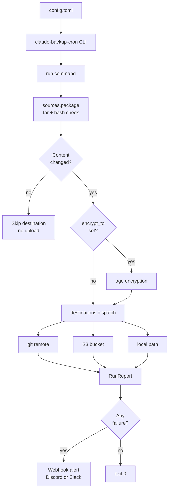

# claude-backup-cron

> **Disclaimer:** This is an **independent third-party tool**. It is **not affiliated with, endorsed by, or sponsored by Anthropic**. "Claude" and "Claude Code" are trademarks of Anthropic and are used here nominatively to identify the directory layout this tool happens to back up.

Scheduled, encrypted backups for small-but-high-value directories —
Claude Code's `memory/` folder in particular, but anything the shape would fit.

**What makes it different from a shell script:** content-hash change detection (mtime lies), optional `age` encryption that refuses to silently downgrade to plaintext, independent per-destination failure handling, structured failure alerts to Discord/Slack, and security hardening against token leakage in logs, branch-name injection, symlink escape, and cron-expression injection.

Zero runtime dependencies on Python 3.11+; `tomli` backport on 3.10.
External binaries (`git`, `aws`, `age`, `crontab`) are invoked only when the corresponding feature is actually used.

---

## Architecture



---

## Quickstart

### Install

```bash
pipx install claude-backup-cron
```

Or in a venv:

```bash
python3 -m venv ~/.local/venvs/claude-backup-cron
~/.local/venvs/claude-backup-cron/bin/pip install claude-backup-cron
```

See [`docs/INSTALL.md`](docs/INSTALL.md) for setup on each destination kind.

### Configure

Default config location: `~/.config/claude-backup-cron/config.toml`.
Override with `$CLAUDE_BACKUP_CRON_CONFIG`.

Minimal example:

```toml
[global]
alert_webhook = "https://discord.com/api/webhooks/..."

[[sources]]
id = "claude-memory"
path = "~/.claude/projects/-home-USER/memory"
exclude = [".git/*", "*.swp"]

[[destinations]]
id = "offsite-git"
kind = "git"
remote = "git@github.com:me/claude-memory-backup.git"
branch = "main"
encrypt_to = "age1abc..."   # omit to upload plaintext
```

Verify it parses:

```bash
claude-backup-cron show-config
```

A fuller example covering all three destination kinds lives in [`examples/config.toml`](examples/config.toml).

### Run

```bash
claude-backup-cron run              # do the thing
claude-backup-cron run --dry-run    # package sources but don't upload
claude-backup-cron run --json       # machine-readable report on stdout
```

Exit codes:

| Code | Meaning |
|------|---------|
| 0 | All steps succeeded (or nothing to do). |
| 2 | At least one source→destination step failed. Others may have succeeded. |
| 3 | Config or encryption setup error — nothing was uploaded. |

### Schedule

```bash
claude-backup-cron install-cron --schedule "0 3 * * *"   # daily 03:00
claude-backup-cron uninstall-cron
```

The installer manages a single block in your user crontab, marked with `# claude-backup-cron managed entry`. Re-running `install-cron` replaces the previous block in place.

---

## How it works

**Phase 1 — Package sources.** Each source directory is tarballed with mtime/uid/gid zeroed so the same tree always produces the same bytes. A SHA-256 content hash is compared against the previous run's state; if nothing changed, the destination upload is skipped entirely.

**Phase 2 — Encrypt (optional).** If `encrypt_to` is set, the artefact is piped through `age --recipient <...>` before it ever reaches a destination. If `age` is missing or fails, the destination fails — it does not fall back to uploading plaintext.

**Phase 3 — Dispatch.** Each (source, destination) pair is attempted independently. A dead S3 bucket does not prevent the git push that follows.

**Phase 4 — Report.** A `RunReport` is returned (or printed as JSON with `--json`). Any failure triggers an HTTPS POST to the configured webhook URL.

### Library API

```python
from claude_backup_cron import load, run

config = load()
report = run(config, dry_run=False)
if not report.ok:
    for failure in report.failed:
        print(failure.source_id, "→", failure.destination_id, failure.message)
```

All public types are frozen dataclasses (`Config`, `SourceSpec`, `DestinationSpec`, `RunReport`, `StepResult`, `Artefact`, `Upload`). Typed Python (`py.typed`); passes `mypy --strict`.

---

## Destination comparison

| Kind | Good for | Avoid when |
|------|----------|------------|
| `git` | Small sources (< ~100 MB), full version history matters | The source is large and churns; every run adds a blob to `.git/objects` that is never deleted. |
| `s3` | Offsite durability with a lifecycle rule for rotation | You don't have (or don't want) an AWS-shaped account. |
| `local` | Spare drive, second machine on LAN, bounded retention (`retain = N`) | You need the backup to survive the laptop being stolen. |

Mix and match — having one `git` destination for history and one `local` destination for recent rollback is a common shape.

---

## Encryption

Set `encrypt_to = "age1..."` on a destination. To decrypt later:

```bash
age --decrypt -i ~/.ssh/my-age-key claude-memory-abc123.tar.age \
  | tar -xvf -
```

**Design commitment:** We refuse to fall back to plaintext on encryption failure — that's exactly the degradation you don't want in a backup tool.

---

## Security hardening

Seven issues addressed over the v0.1.x series that a naive shell script would get silently wrong:

- **Token redaction in destination logs.** `git push` stderr can contain auth tokens; four token shapes are stripped before the output reaches the webhook or log.
- **Branch-name injection.** `_SAFE_BRANCH_RE` rejects anything outside `[A-Za-z0-9._/-]`.
- **Symlink-escape on tar.** Each member's resolved path is re-checked against the source root with `Path.is_relative_to`.
- **Cron-expression injection.** `_CRON_EXPRESSION_RE` rejects any entry that doesn't parse as a 5-field schedule.
- **`age` binary impostor.** `age --version` is parsed and matched against an expected prefix before any encryption pipeline runs.
- **Webhook scheme allow-list.** Only `http://` and `https://` URLs are accepted; `file://`, `gopher://`, and other schemes are rejected.
- **Atomic private-dir creation.** State dirs are created with mode `0o700` in one syscall.

See [`SECURITY.md`](SECURITY.md) for the vulnerability reporting process.

---

## Threat model & non-goals

- **In scope**: accidental data loss (mistaken `rm`, disk failure, lost laptop, revoked cloud account).
- **Out of scope**: targeted attack by someone with root on the host. If the attacker can read your config and your age identity file, they can already read your unencrypted source.
- **Out of scope**: real-time sync. The minimum meaningful schedule is whatever cron runs; continuous replication is a different product.

---

## Verification (sigstore)

Releases from **v0.1.3** (released after 2026-05-16) include a sigstore keyless signature bundle (`.sigstore` per artifact) attached to the GitHub Release.

```bash
pip download <pkg-name>==<version> --no-deps -d ./verify
python -m sigstore verify github \
    --cert-identity 'https://github.com/hinanohart/claude-backup-cron/.github/workflows/release.yml@refs/tags/v<version>' \
    --cert-oidc-issuer 'https://token.actions.githubusercontent.com' \
    ./verify/*.whl ./verify/*.tar.gz
```

Earlier releases (pre-2026-05-16) were published without sigstore bundles.

---

## License

MIT. See [`LICENSE`](LICENSE).
